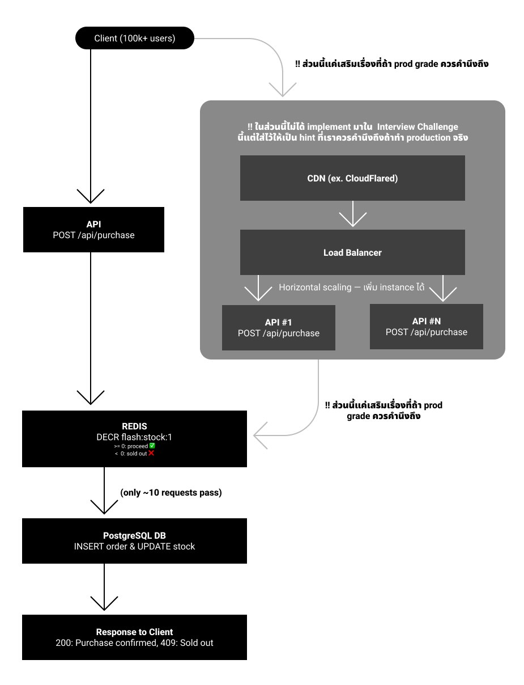

# Flash Sale System — High-Concurrency Purchase API
---

## Architecture

- Flowchart


---

## Tools & Library

| - | Tech | หมายเหตุ |
|-----------|-----------|-----------|
| Guard | Redis (ioredis) — atomic `DECR` | ใช้ DECR ลดจำนวน stock เพื่อดัก request ที่จะเข้าไปกระทบ database จริง |
| Integration Testing | Vitest + Supertest | ใช้ทำ integration และ unit test |
| Load Testing | k6 | ใช้สำหรับทำ load test เพื่อทดสอบว่ารับ transection ได้มากน้อยแค่ไหน |

---

## ป้องกัน Race Condition

| Layer | - | จุดประสงค์ |
|-------|-----------|---------|
| Redis | `DECR` atomic counter | filters 99.99% ของ request ที่เข้ามา |
| PostgreSQL | `SELECT ... FOR UPDATE` row lock | ให้ db รอทำที่ละ row เพื่อป้องกันที่ระดับ database |
| Stock Check | `stock > 0` validation in transaction | เพิ่มเชค stock ป้องกันอีกชั้น |

---

## Prerequisites

- **Node.js** v24+
- **PostgreSQL** running on `localhost:5432`
- **Redis** running on `localhost:6379`
- **k6** (for load testing): `brew install k6`

---

## Setup & Installation

### 1. Install dependencies

```bash
npm install
```

### 2. Configure environment

สร้างไฟล์ `.env`

```env
# PostgreSQL
DB_USER=postgres
DB_HOST=localhost
DB_PORT=5432
DB_PASSWORD=secret
DB_NAME=flash_sales

# Redis
REDIS_HOST=localhost
REDIS_PORT=6379

# Stock
INITIAL_STOCK=10 # จำนวนสินค้าเริ่มต้นตอน seed (ใช้ใน db:seed, db:reset, test)

# Load Test (k6)
LOAD_VUS=1000 # จำนวน virtual users ที่ยิงพร้อมกัน
LOAD_ITERATIONS=100000 # จำนวน requests ทั้งหมดที่จะยิง
```

### 3. Run database migration

```bash
npm run db:migrate
```

### 4. Seed the database

```bash
npm run db:seed
```

จะสร้าง 1 product กับ stock = `INITIAL_STOCK` (default: 10).

---

## Running the Server

### Development mode

```bash
npm run dev
```

Server starts on `http://localhost:3000`.

---

## API Endpoints

### GET /api/products/:id

ดูข้อมูลสินค้าพร้อม stock ปัจจุบัน

```bash
curl http://localhost:3000/api/products/1
```

Response:
```json
{
  "id": 1,
  "name": "Limited Edition Item",
  "description": "Exclusive flash sale product — only 10 available!",
  "price": 1990,
  "stock": 10,
  "isSoldOut": false
}
```

### GET /api/products/:id/stock

เช็ค stock จาก Redis

```bash
curl http://localhost:3000/api/products/1/stock
```

Response:
```json
{
  "productID": 1,
  "stock": 10,
  "isSoldOut": false
}
```

### POST /api/purchase

api สำหรับสั่งซื้อสินค้า

```bash
curl -X POST http://localhost:3000/api/purchase \
  -H "Content-Type: application/json" \
  -d '{"productID": 1, "userID": "user-123"}'
```

Success (200):
```json
{
  "success": true,
  "orderID": 1,
  "message": "Purchase confirmed"
}
```

Sold out (409):
```json
{
  "success": false,
  "message": "Sold out"
}
```

### GET /health

Health check

```bash
curl http://localhost:3000/health
```

---

## Testing

### Run integration tests

```bash
npm test
```

### Run load test (100,000 concurrent requests)

First, start the server:

```bash
npm run dev
```

Then in another terminal:

```bash
npm run test:load:reset
```

---
